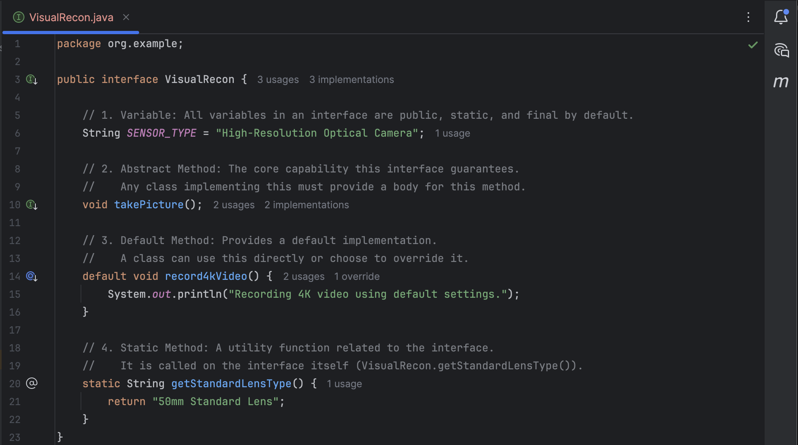

# Cadet Training Module: Java Inheritance and Interfaces
**Name:** Andre Dominic Ha Lacra

---

## Screenshots of Output and each Sections

---

### --- Overall Program Output ---

**Output Screenshot:**  

---

### Section 1: The Foundation - The Drone Abstract Class

**Output Screenshot:**  

---

### Section 2: Defining a Capability - The VisualRecon Interface

**Output Screenshot:**  

---

### Section 3: The First Unit - Implementing the QuadCopter

**Output Screenshot:**  

---

### Section 4: The Mission Control and Execution

**Output Screenshot:**  

---

### Section 5: Expanding Capabilities by Extending Interfaces

**Output Screenshot:**  

---

### Section 6: Deploying an Advanced Drone

**Output Screenshot:**  

---
